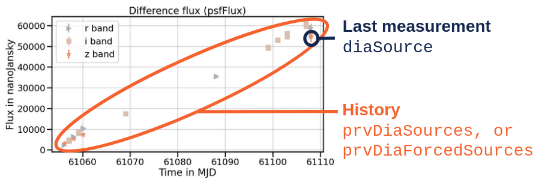
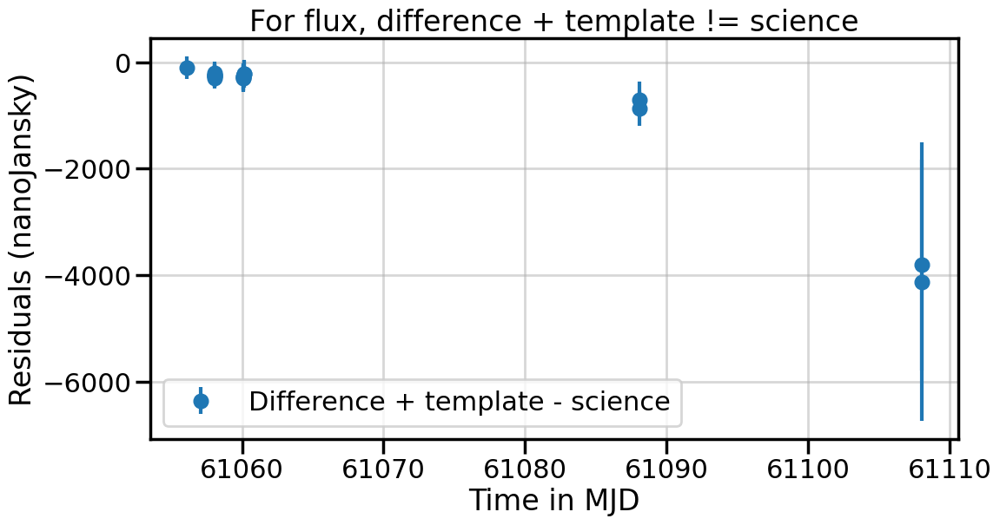
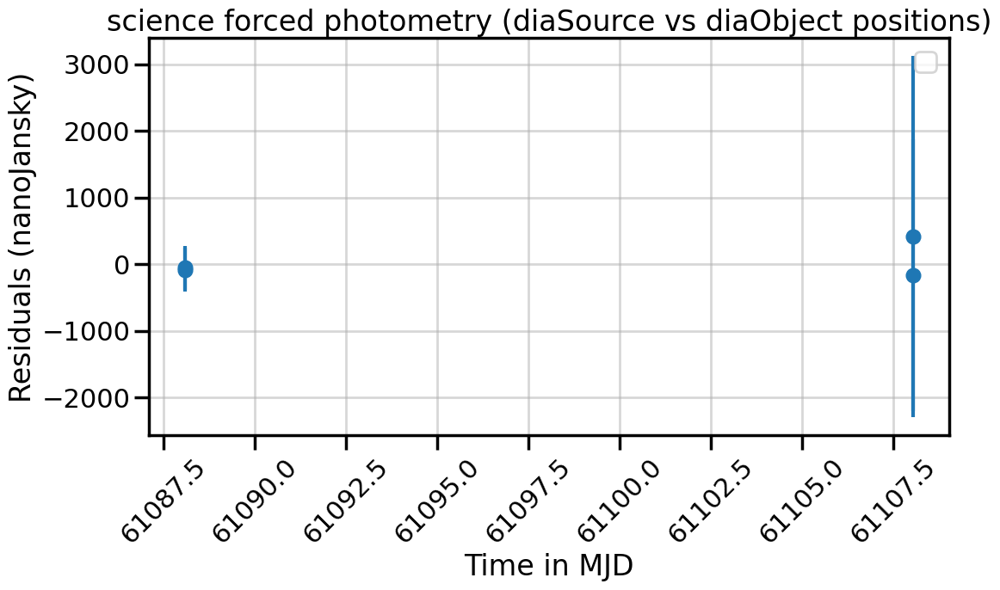

# Alert photometry

Photometry is the art of measuring light from an image taken by the telescope. Inside an alert packet, there are various photometric measurements. This page will walk you through the important quantities, and how they relate to each other.

!!! tips "Cheatsheet"
    For a given alert, with nested fields `diaSource`, `prvDiaSources`, and `prvDiaForcedSources`:

    | Field                                      | Description                                                   |
    |--------------------------------------------|---------------------------------------------------------------|
    | `diaSource.psfFlux`                       | PSF photometry on the difference image                        |
    | `diaSource.scienceFlux`                   | Forced photometry on the science image, based on `diaSource` positions |
    | `diaSource.templateFlux`                   | Forced photometry on the template image, based on `diaSource` positions |
    | `prvDiaSources.psfFlux`                   | Collection of past `diaSource.psfFlux`                       |
    | `prvDiaSources.scienceFlux`                | Collection of past `diaSource.scienceFlux`                   |
    | `prvDiaSources.templateFlux`               | Collection of past `diaSource.templateFlux`                  |
    | `prvDiaForcedSources.psfFlux`             | Forced photometry on the difference image, based on `diaObject` positions (past and present) |
    | `prvDiaForcedSources.scienceFlux`          | Forced photometry on the science image, based on `diaObject` positions (past and present) |

Here is a typical lightcurve example using values from `diaSource.psfFlux` and `prvDiaSources.psfFlux`:



## PSF vs aperture photometry

The alert pipeline has two main methods to extract photometry from the images: Point Spread Funtion (PSF), and aperture photometry.

The PSF photometry is a technique using a model of the Point Spread Function to measure the brightness of point sources. It involves fitting a PSF model to the observed data, accounting for blurring effects. Inside the alert packet, fields derived from a full PSF photometry technique will be explicitly prefixed by `psf` (e.g. `psfFlux`).

Aperture photometry is a method that sums the pixel values within a defined circular aperture around the target source. Conversely to PSF photometry, it relies on defining a fixed aperture size and shape without compensating for point spread effects. Inside the alert packet, fields derived from an aperture technique will be prefixed by `ap` (e.g. `apFlux`).

While most of Fink examples in this documentation will use PSF photometry measurements, you can access both via all services.

## Nightly measurements

For every observation of the sky, 3 images are generated: the new observation (aka science), a reference image of the same region of the sky made of the co-addition of previous observations at the same position (aka template), and the difference image between science and template (aka difference).

Full photometry is performed on the difference image, that is source coordinates finding, point source modelling, and photometry estimation. Then, on the coordinates of the sources found in the difference image, _forced_ PSF photometry is performed on the template and science images. Forced PSF photometry is the same as PSF photometry, except there is no source finding step: we force the photometry extraction to start at the centroid positions given by the difference image.

### Difference image photometry

On the difference image, coordinates of centroids are found, PSF photometry is extracted, and packaged inside a field called `diaSource` (DIA = Difference Image Analysis). For example, PSF photometry measurements are:

- `diaSource.psfFlux`: flux estimated by PSF photometry in the difference image
- `diaSource.psfFluxErr`: Uncertainty in the flux estimated by PSF photometry in the difference image

In addition, you have many fields prefixed by `psf` (e.g. `psfFlux_flag`) which are quantities related to the fit itself, and its quality.

### Science and template photometry

Once the sources have been found on the difference image, the alert pipeline estimates the flux of these sources in the science and template images. This is refer as to _forced_ photometry as despite the fact that PSF modelling technique is applied, the coordinates of the centroids are those from the sources found in the difference image. In this case, flux quantities are for example:

- `diaSource.scienceFlux`: flux estimated by PSF photometry in the science image
- `diaSource.templateFlux`: flux estimated by PSF photometry in the template image

!!! danger "Naming inconsistency"
    Flux estimates in science and template are prefixed by provenance (`scienceFlux`, `templateFlux`), but flux estimate in the fifference image is not called `differenceFlux`, but `psfFlux`.

!!! info "Operations are not linear"
    The flux estimated in the difference image is not the one from the science image minus the one from the template.

    

## Historical measurements

For a fixed position on the sky, there might be several alerts emitted over time. In this case, for every new alert, the past measurements are also attached to the alert packet. This is what we call the history. In practice, there are several fields containing historical measurements:

- `prvDiaSources`: collection of previous `diaSource` measurements (just a copy/paste of past `diaSource` entries)
- `prvDiaForcedSources`: collection of forced-photometry source measurements based on `diaObject` positions (historical measurements, plus current measurements)

!!! danger "Delay in association"
    Because there is an association delay in the Rubin alert pipeline, it might not be possible to associate a previous alert with a new one if the time delay between the two is too short. In that case, last available `prvDiaSources` is simply duplicated inside the alert package. Here is a sequence of values for subsequent alerts from the same object:
    ```python
    diaSource.midpointMjdTai    diaSource.scienceFlux       last(prvDiaSources.scienceFlux)  
    61108.091155                110557.929688               61453.898438  
    61108.090689                111676.656250               61453.898438  
    61108.086385                61453.898438                112819.250000  
    61106.248607                112819.250000               63908.562500  
    61106.248142                107468.218750               63908.562500  
    61106.243374                63908.562500                108950.460938  
    61105.095801                108950.460938               109212.460938  
    61105.095334                113536.062500               109212.460938  
    ```


In practice, this means forced photometry values for `prvDiaSources.scienceFlux` and `prvDiaForcedSources.scienceFlux` (for the same visit) are similar but different as the centroids used to perform forced photometry are different (`diaSource` position vs `diaObject` position).



## Photometry tutorials

You can explore a series of notebooks to manipulate photometry with Fink:

- Tutorials for Data Transfer: [link :lucide-external-link:](https://github.com/astrolabsoftware/fink-tutorials/blob/main/lsst/photometry/data_transfer_photometry.ipynb){target="blank_"}
- Tutorials for REST API: [link :lucide-external-link:](https://github.com/astrolabsoftware/fink-tutorials/blob/main/lsst/photometry/api_photometry.ipynb){target="blank_"}
