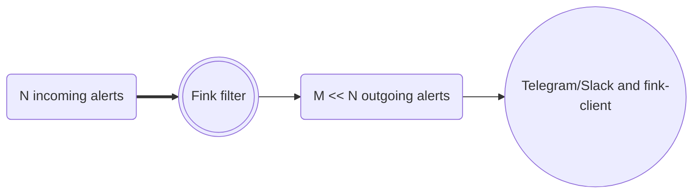

# Fink filters

## What is a Fink filter?

Each night, telescopes are sending raw alerts and Fink enriches these alerts by adding new information to identify interesting candidates for follow-up observations or further scientific processing (see [Fink Science Modules](science_modules.md)). Defining what is considered _interesting_ varies significantly from person to person, as individual scientific interests and curiosities differ widely. Recognizing this, our strategy focuses on enabling users to extend Fink by incorporating their unique scientific logic and receive tailored outputs that align with their own perspectives.

To facilitate this personalization, we have introduced the concept of Fink Filters, which allow users to receive alerts of interest by imposing conditions on any fields produced by Rubin or any of the Fink Science Modules outputs provided by the community of users. Their code can be found in the [fink-filters :lucide-external-link:](https://github.com/astrolabsoftware/fink-filters/blob/master/fink_filters/rubin/livestream){target="blank_"} code repository

Note that if the filters reduce the size of the stream, they do not filter the content of alerts, i.e. you will receive the full information of alerts distributed (unless you want less!).

## Fink blocks

Some set of conditions are common to many scientists: alerts away from the galaxy, with or without a counterpart with some catalogs, etc... Therefore we provide common blocks, the Fink blocks, to ease the construction of filters. Their code can be found in the [fink-filters :lucide-external-link:](https://github.com/astrolabsoftware/fink-filters/blob/master/fink_filters/rubin/blocks.py){target="blank_"} code repository, and they are also exposed in the [schema page :lucide-external-link:](https://lsst.fink-portal.org/schemas){target="blank_"}.

## Retrieving data from filters

### Kafka streams

As we process alerts, interesting alerts are automatically picked up by filters and [Apache Kafka :lucide-external-link:](https://kafka.apache.org/){target="blank_"} queues are populated. Each stream from a particular filter is identified by a topic name. This stream can be accessed outside via its topic, and several users can poll the data independently from the same topic. All topics can be accessed using the [Fink client :lucide-external-link:](https://github.com/astrolabsoftware/fink-client){target="blank_"}, which is a wrapper around Kafka consumer functionalities (see [Livestream documentation](https://doc.lsst.fink-broker.org/en/latest/services/livestream)).

### REST API & Science Portal

!!! tip "Accessing filter data from API"
    With LSST, you can access filter data with the REST API using the `/api/v1/tags` endpoint. This is not possible with ZTF. See [Search by tags](services/api/tagsearch.md) for more information.

### Fink bots

In addition, for some filters, we redirect the data to instant messaging services such as Telegram or Slack (just ask for it if you need other platforms!). Below we summarise the widely used Fink topics, with their availability on Slack and Telegram (for Telegram, you can directly subscribe using the link or the QR code below).

<!-- ## Available topics

| Name | Content | Slack bot (fink-broker workspace) | TG bot (public) |
|:--------|:-------|:--------|:--------|
| [fink_early_sn_candidates_ztf](https://github.com/astrolabsoftware/fink-filters/blob/master/fink_filters/ztf/livestream/filter_early_sn_candidates/filter.py) | Return alerts considered as Early SN-Ia candidates. The data from this topic is pushed to TNS every night. | #bot_tns | [Fink Early SN Ia](https://t.me/fink_early_ia)  |
| [fink_tns_match](https://github.com/astrolabsoftware/fink-filters/tree/master/fink_filters/ztf/livestream/filter_tns_match/filter.py) | Return alerts with classified counterparts in TNS | -- | [Fink TNS](https://t.me/fink_tns)  |
| [fink_yso_spicy_candidates_ztf](https://github.com/astrolabsoftware/fink-filters/blob/master/fink_filters/ztf/livestream/filter_yso_spicy_candidates/filter.py) | Return alerts alerts with a match in the [SPICY catalog](https://vizier.cds.unistra.fr/viz-bin/VizieR-3?-source=J/ApJS/254/33/table1) hosted at CDS. | -- | [Fink SPICY](https://t.me/spicy_fink)  |
| [fink_magnetic_cvs_ztf](https://github.com/astrolabsoftware/fink-filters/blob/master/fink_filters/ztf/livestream/filter_magnetic_cvs/filter.py) | Return alerts matching a catalog of Magnetic Cataclysmic Variables | -- | [Fink magnetic CV stars](https://t.me/fink_magnetic_cv_stars)  |
| [fink_sn_candidates_ztf](https://github.com/astrolabsoftware/fink-filters/blob/master/fink_filters/ztf/livestream/filter_sn_candidates/filter.py) | Return alerts considered as SN candidates | -- | -- |
| [fink_sso_ztf_candidates_ztf](https://github.com/astrolabsoftware/fink-filters/blob/master/fink_filters/ztf/livestream/filter_sso_ztf_candidates/filter.py) | Return alerts with a counterpart in the Minor Planet Center database (Solar System Objects) | -- | -- |
| [fink_sso_fink_candidates_ztf](https://github.com/astrolabsoftware/fink-filters/blob/master/fink_filters/ztf/livestream/filter_sso_fink_candidates/filter.py) | Return alerts considered as new Solar System Object candidates | -- | -- |
| [fink_kn_candidates_ztf](https://github.com/astrolabsoftware/fink-filters/blob/master/fink_filters/ztf/livestream/filter_kn_candidates/filter.py) | Return alerts considered as Kilonova candidates based on Machine Learning | #bot_kilonova-candidates | -- |
| [fink_early_kn_candidates_ztf](https://github.com/astrolabsoftware/fink-filters/blob/master/fink_filters/ztf/livestream/filter_early_kn_candidates/filter.py) | Return alerts considered as Kilonova candidates based on crossmatch and property cuts | #bot_kilonova-candidates | -- |
| [fink_rate_based_kn_candidates_ztf](https://github.com/astrolabsoftware/fink-filters/blob/master/fink_filters/ztf/livestream/filter_rate_based_kn_candidates/filter.py) | Return alerts considered as Kilonova candidates following Andreoni et al. 2021 (https://arxiv.org/abs/2104.06352) | #bot_kilonova-candidates | -- |
| [fink_microlensing_candidates_ztf](https://github.com/astrolabsoftware/fink-filters/blob/master/fink_filters/ztf/livestream/filter_microlensing_candidates/filter.py) | Return alerts considered as microlensing candidates | -- | -- |
| [fink_blazar_ztf](https://github.com/astrolabsoftware/fink-filters/blob/master/fink_filters/ztf/livestream/filter_blazar/filter.py) | Return alerts flagged as `Blazar`, `Blazar_Candidate`, `BLLac`, or `BLLac_Candidate` in the SIMBAD database. | -- | -- |
| [fink_new_hostless_ztf](https://github.com/astrolabsoftware/fink-filters/blob/master/fink_filters/ztf/livestream/filter_new_hostless/filter.py) | Find newly appearing and hostless transients | -- | -- |
| [fink_intra_night_hostless_ztf](https://github.com/astrolabsoftware/fink-filters/blob/master/fink_filters/ztf/livestream/filter_intra_night_hostless/filter.py) | Find new hostless transients that repeat over the same night | -- | -- |
| [fink_inter_night_hostless_ztf](https://github.com/astrolabsoftware/fink-filters/blob/master/fink_filters/ztf/livestream/filter_inter_night_hostless/filter.py) | Find new hostless transients that repeat over nights | -- | -- |
| [fink_vra_ztf](https://github.com/astrolabsoftware/fink-filters/blob/master/fink_filters/ztf/livestream/filter_vra/filter.py) | Alerts not cross-matched to SIMBAD and are not highly likely to be asteroids. Used to feed the prototype of the Fink Virtual Research Assistant used to help extra-galactic transient astronomers find interesting alerts. (See [ATLAS VRA](https://heloises.github.io/atlasvras/about.html) for more details | -- | -- |
| [fink_grb_bronze](https://github.com/astrolabsoftware/fink-filters/blob/master/fink_filters/ztf/filter_mm_module/filter.py) | Alerts with a real bogus (rb) above 0.7, classified by Fink as an extragalactic event within the error location of a GRB event. | -- | -- |
| [fink_grb_silver](https://github.com/astrolabsoftware/fink-filters/blob/master/fink_filters/ztf/filter_mm_module/filter.py) | Alerts satisfying the bronze filter with a `grb_proba` above 5 sigma. | -- | -- |
| [fink_grb_gold](https://github.com/astrolabsoftware/fink-filters/blob/master/fink_filters/ztf/filter_mm_module/filter.py) | Alerts satisfying the silver filter with a `mag_rate` above 0.3 mag/day and a `rb` above 0.9. | -- | -- |
| [fink_gw_bronze](https://github.com/astrolabsoftware/fink-filters/blob/master/fink_filters/ztf/filter_mm_module/filter.py) | Alerts with a real bogus (`rb`) above 0.7, classified by Fink as an extragalactic event within the error location of a GW event. | -- | -- |

_Example of the Early SN Ia Telegram bot_

Feel free also to propose new topics! The topic data is stored for 4 days after creation (i.e. you can access alert data up to 4 days after it has been emitted). -->

<!-- ### After the night filters

Some filtering operations do not require real-time, or require the need for the full night data to select interesting alerts (e.g. sorting alerts based on a score, and selecting the top-10). These filters are typically run a few hours after the observing night has ended.

| Name | Content | Slack bot (fink-broker workspace) | TG bot (public) |
|:--------|:-------|:--------|:--------|
| [Anomaly detection](https://github.com/astrolabsoftware/fink-filters/blob/master/fink_filters/ztf/filter_anomaly_notification/filter.py) | Return alerts with highest anomaly scores each night (top 10) | #bot_anomaly | [Fink anomaly bot](https://t.me/ZTF_anomaly_bot)  |
| [Hostless transients](https://github.com/astrolabsoftware/fink-broker/blob/master/bin/ztf/archive_hostless.py) | Return hostless alert candidates from the [ELEPHANT](https://arxiv.org/abs/2404.18165) pipeline. | -- | [Fink Hostless](https://t.me/fink_hostless)  |
| [Symbiotic stars](https://github.com/astrolabsoftware/fink-broker/blob/master/bin/ztf/archive_symbiotic_and_cv_stars.py) | Return alerts matching a catalog of Symbiotic stars, with magnitude increase greater than 0.5 | -- | [Fink Symbiotic stars](https://t.me/fink_symbiotic_stars)  |
| [CV stars](https://github.com/astrolabsoftware/fink-broker/blob/master/bin/ztf/archive_symbiotic_and_cv_stars.py) | Return alerts matching a catalog of Cataclysmic Variable stars, with magnitude increase greater than 3.0 | -- | [Fink CV stars](https://t.me/fink_cv_stars)  |
| [Known TDE](https://github.com/astrolabsoftware/fink-filters/blob/master/fink_filters/ztf/filter_known_tde/filter.py) | Return alerts matching with known TDEs | #bot_known_tde_follow_up | -- |
| [Active Learning for SN Ia](https://github.com/astrolabsoftware/fink-broker/blob/master/bin/ztf/archive_ia_active_learning.py) | Return alerts with SN Ia probability close to 0.5 for active learning studies. | #bot_al_loop | -- |
| [Dwarf AGN](https://github.com/astrolabsoftware/fink-filters/blob/master/fink_filters/ztf/filter_dwarf_agn/filter.py) | Return alerts matching with custom catalog of dwarf AGN. | #bot_manga | -- | -->
