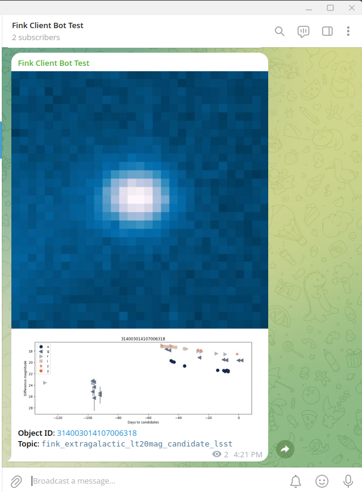
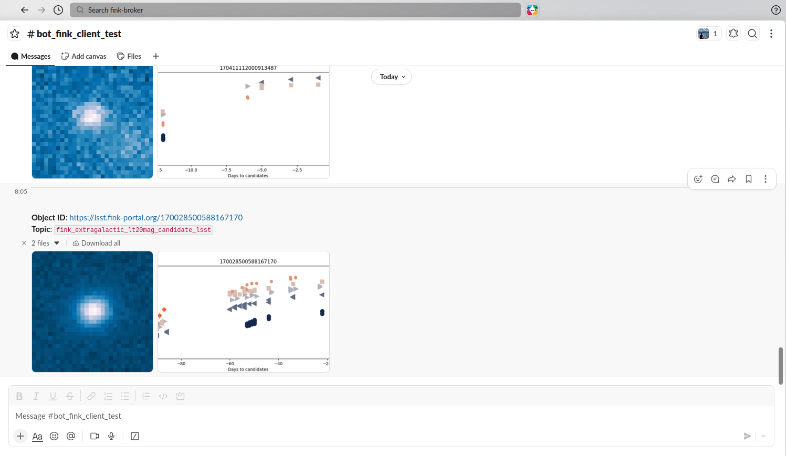

# Fink bots

!!! info "Version 03/06/2026"
    This manual has been tested for `fink-client` version 12.0. In case of trouble, send us an email (contact@fink-broker.org) or [open an issue :lucide-external-link:](https://github.com/astrolabsoftware/fink-client/issues){target="blank_"}.

## Purpose

We all have our own habits for working and taking in information. Some prefer command-line interfaces, while others favor web interfaces or smartphone apps. Receiving alerts is no different. Although the fink-client is a convenient way to interact with Fink, we recognize it may not suit every use case or user.

A Fink bot is a program that listens to alerts from the Fink Livestream and forwards alert content to instant‑messaging apps such as Telegram or Slack. It makes it easy to scroll through alerts of interest on a smartphone or web interface. Bots existed during the Fink/ZTF era but were run inside the Fink platform. Starting with fink-client version 12, any user can now create and run a Fink bot independently.

## Installation of fink-client

You would simply install the latest version of the client using pip in your terminal:

```bash
pip install fink-client --upgrade
```

Check the client is correctly installed by running:

```bash
finkctl
```

You should see the help menu, together with the version of the client. Note that you must register before polling data. Please refer to the "Registration" section in the [fink-client :lucide-external-link:](https://github.com/astrolabsoftware/fink-client#registration){target="blank_"} GitHub repository.

## Creating a bot

To create a bot you will need three things:
1. An account on the Fink Livestream (see above)
2. Write permission for a channel in an instant‑messaging app
3. Subscription to one or more topics in Fink

## Instant-messaging app permission

Each app has its own way to register and enable message submission. We detail the procedure for Telegram and Slack.

### Telegram

Assuming you have an account on Telegram, create a bot using BotFather (or re-use one if you already created one) to obtain a token to publish messages. The procedure for creating bots is detailed at [https://core.telegram.org/bots/features#creating-a-new-bot :lucide-external-link:](https://core.telegram.org/bots/features#creating-a-new-bot){target="blank_"}. Once you have the token, create a channel to host the alert messages. Give it a meaningful name, add your bot to the channel manually and promote it to admin with post permission. 

Then register these parameters on Fink for the topic you want to redirect alerts from:

```bash
finkctl topic subscribe \
    -survey lsst \
    -name fink_extragalactic_lt20mag_candidate_lsst \
    -telegram_token <TOKEN> \
    -telegram_channel @<channel_name>
```

You can check at any time your configuration per topic using `finkctl auth show -survey lsst`:

```yaml
...
survey: lsst
topics:
  fink_extragalactic_lt20mag_candidate_lsst:
    telegram:
      channel: '@channel_name'
      token: <TOKEN>
...
```

Then make a test by submitting only 1 alert to you channel:

```bash
finkctl stream -survey lsst -limit 1 --telegram
```

You should see a cutout and a lightcurve appearing in your channel!



Then launch the client forever:

```bash
# put it as daemon and redirect log to telegram.log
nohup finkctl stream -survey lsst --telegram > telegram.log 2>&1 &
```

In case you want to stop it:

```bash
# Assuming you do not have other finkctl processes running
pkill -f finkctl

# or get the PID for the process
ps aux | grep finkctl
# fink      541199  7.2  2.7 1050064 229440 pts/0  Sl   08:45   0:04 python /finkenv/bin/finkctl stream -survey lsst --telegram
kill 541199
```

### Slack

Assuming you have an account on a Slack workspace, the first thing to do is to create a Slack App if you do not have one yet. Visit the Slack App Directory online ([api.slack.com/apps](api.slack.com/apps)) and:

1. Click "Create New App" → select "From scratch"
2. Enter an app name (e.g., "MessageBot") and select your workspace
3. Click "Create App"

Then generate a Bot token:

1. In the left sidebar, click "OAuth & Permissions"
2. Scroll to "Scopes" and add these bot token scopes:
    1. `chat:write` (post messages)
    2. `channels:manage` (create channels)
    3. `channels:read` (list channels)
3. Scroll up to "OAuth Tokens for Your Workspace" and click "Install to Workspace"
4. Authorize the app
5. Copy your Bot User OAuth Token (starts with `xoxb-`)

Then create a channel in your Slack workspace, click "Channel details" → select "Open channel details" → select "Integrations" → select "Add apps" and add your app. Then register the parameters on Fink for the topic you want to redirect alerts from:

```bash
finkctl topic subscribe \
    -survey lsst \
    -name fink_extragalactic_lt20mag_candidate_lsst \
    -slack_token <TOKEN> \
    -slack_channel <channel_name>
```

If you already have a Telegram bot associated to this topic, this will not overwrite the Telegram parameters, and add alongside the Slack ones. You can check at any time your configuration per topic using `finkctl auth show -survey lsst`:

```yaml
...
survey: lsst
topics:
  fink_extragalactic_lt20mag_candidate_lsst:
    slack:
      channel: channel_name
      token: <TOKEN>
...
```

Then make a test by submitting only 1 alert to you channel:

```bash
finkctl stream -survey lsst -limit 1 --slack
```

You should see a cutout and a lightcurve appearing in your channel!



Then launch the client forever:

```bash
# put it as daemon and redirect log to slack.log
nohup finkctl stream -survey lsst --slack > slack.log 2>&1 &
```

In case you want to stop it:

```bash
# Assuming you do not have other finkctl processes running
pkill -f finkctl

# or get the PID for the process
ps aux | grep finkctl
# fink      541199  7.2  2.7 1050064 229440 pts/0  Sl   08:45   0:04 python /finkenv/bin/finkctl stream -survey lsst --slack
kill 541199
```

### Combining channels

You can send alerts to many apps at the same time:

```bash
finkctl stream -survey lsst -limit 1 --slack --telegram
```
