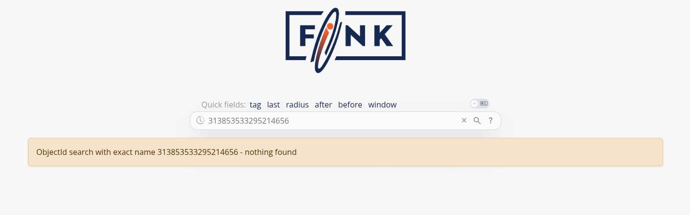

# Fink Data Transfer

_date 08/04/2026_

This manual has been tested for `fink-client` version 11.0. In case of trouble, send us an email (contact@fink-broker.org) or [open an issue :lucide-external-link:](https://github.com/astrolabsoftware/fink-client/issues){target="blank_"}.

!!! info "From ZTF to LSST"
    ZTF users need to migrate their fink-client to at least version 10.0, and authenticate again.

## Purpose

The Data Transfer service allows users to explore and transfer historical data at scale: [https://lsst.fink-portal.org/download :lucide-external-link:](https://lsst.fink-portal.org/download){target="blank_"}. This service lets users to select any observing nights from LSST, define the content of the output, and stream data directly to anywhere!

In Fink you used so far two main services to interact with the alert data:

1. Fink Livestream: based on Apache Kafka, to receive alerts in real-time based on user-defined filters.
2. Fink Science Portal: web application (and REST API) to access and display all processed data.

The first service enables data transfer at scale, but you cannot request alerts from the past. The second service lets you query data from the beginning of the project, but the volume of data to transfer for each query is limited. **Hence, we were missing a service that would enable massive data transfer for historical data.**

This third service is mainly made for users who want to access a lot of alerts for:

1. building data sets,
2. training machine/deep learning models,
3. performing massive or exotic analyses on processed alert data provided by Fink.

We decided to _stream_ the output of each job. In practice, this means that the output alerts will be send to the Fink Apache Kafka cluster, and a stream containing the alerts will be produced. You will then act as a consumer of this stream, and you will be able to poll alerts knowing the topic name. This has many advantages compared to traditional techniques:

1. Data is available as soon as there is one alert pushed in the topic.
2. The user can start and stop polling whenever, resuming the poll later (alerts are in a queue).
3. The user can poll the stream many times, hence easily saving data in multiple machines.
4. The user can share the topic name with anyone, hence easily sharing data.
5. The user can decide to not poll all alerts.


## Installation of fink-client

To ease the consuming step, the users are recommended to use the [fink-client :lucide-external-link:](https://github.com/astrolabsoftware/fink-client){target="blank_"}, which is a wrapper around Apache Kafka. `fink_client` requires a version of Python 3.9+. Documentation to install the client can be found at [services/fink_client](../developers/fink_client.md). Note that you need to be registered in order to poll data.

## Defining your query

To start the service, connect to [https://lsst.fink-portal.org/download :lucide-external-link:](https://lsst.fink-portal.org/download){target="blank_"}. The construction of the query is a guided process.
First, if you have a configuration file, you can upload it. If you do not know what it is, no worry, we will see it later. Then jump on the next page to choose the dates for which you would like to get alert data using the calendar. You can choose multiple consecutive dates. Then go on the next page:


For LSST, you can further filter the data in three ways:

1. You can select one or more user-defined tag(s) (the Fink Filters). This is useful if you want to replay an analysis on a previous night.
2. You can select one or more user-defined block(s). Blocks are useful set of conditions.
3. Optionally, you can also impose extra conditions on the alerts you want to retrieve based on their content. You will simply specify the name of the parameter with the condition (SQL syntax). If you have several conditions, put one condition per line, ending with semi-colon. Example of valid conditions:

```sql
-- Example block 1
-- Alerts with flux above 13500 nJy (< mag 21) and
-- at least 3 detections
diaSource.psfFlux > 13500;
diaObject.nDiaSources > 3;

-- Example block 2: Filter on magnitude and specific band
diaSource.band = 'g';
31.4 - 2.5 * LOG10(diaSource.scienceFlux) < 21;

-- Example block 3: Using a combination of fields (magnitude difference between science and template)
2.5 * LOG10(diaSource.psfFlux / diaSource.templateFlux) > 0.5;

-- Example block 3: Filtering on ML scores
clf.snnSnVsOthers_score > 0.5;

-- Example block 4: Filtering on catalog output
xm.tns_type IN ('SN Ia', 'SN II');

-- Example block 5: Only classified objects in SIMBAD and Gaia DR3
pred.is_cataloged;
```

Note that when you start typing a nested field in the schema, a dropdown menu will appear with available fields. See the [schema page :lucide-external-link:](https://lsst.fink-portal.org/schemas){target="blank_"} for more information about available tags, block, and fields.

Finally you can choose the content of the alerts to be returned. You have four types of content:
1. Light packet: lightweight (a few KB/alerts), this option transfers only necessary fields for working with lightcurves plus all Fink added values. Prefer this option to start.
2. Medium packet: original LSST alerts plus all Fink added values, but without cutouts.
4. Full packet: original LSST alerts plus all Fink added values.
4. Any fields you want: instead of the pre-defined schema from above, you can also choose to download only the fields of interest for you. Prefer this option if you know what you want (and this will reduce greatly the volume of data to transfer).

Alert schema can be again accessed directly from the [schema page :lucide-external-link:](https://lsst.fink-portal.org/schemas){target="blank_"}. Note that you can apply filters (e.g. tags, extra conditions, etc.) on any alert fields regardless of the final alert content as the filtering is done prior to the output schema. Once you have filled all parameters, go to the last iteration, and review all parameters before hitting the submission button:


The number of alert estimation is only the number of alerts between the chosen dates, and it does not take into account the number of alerts per night, the number of alerts filtered per tags and blocks, and the extra conditions (that could further reduce the number of alerts). However we provide an estimation of the size of the data to be transfered based on the content. You can update your parameters if need be, the estimations will be updated in real-time.

Before submission, download your configuration file. Next time you launch a job, you will be able to upload it to retrieve your parameters!


After submission, your job will be triggered on the Fink Apache Spark cluster, and a topic name will be generated. Keep this topic name with you, you will need it to get the data. Details about the progress will be automatically displayed on the page.

## Consuming the alert data

### Standard

On the submission web page, when you read the message:

```bash
26/02/24 21:35:14 -Livy- Starting to send data to topic ftransfer_lsst_2026-02-24_34995
```

this means you can already start polling the data on your computer. You will then invoke for example (see the command on the right panel):

```bash
fink_datatransfer \
    -survey lsst \
    -topic ftransfer_lsst_2026-02-24_34995 \
    -outdir ftransfer_lsst_2026-02-24_34995 \
    --dump_schemas \
    --verbose
```

Alert data will be consumed and stored on disk as parquet files. You can easily read these alerts using Pyarrow, or Pandas: 

=== "Polars"
    Polars is an efficient replacement for Pandas, both in term of speed and data type management.

    ```python
    import polars as pl

    pdf = pl.read_parquet("ftransfer_lsst_2026-03-27_300346/")
    ```

    Beware, if you want transform this table into a Pandas DataFrame, you will likely have type issues with the column `diaObjectId`. See the `Troubleshooting` section of this manual.

=== "Pyarrow"
    ```python
    import pyarrow.parquet as pq

    arrow_schema = pq.read_schema("arrow_schema_ftransfer_lsst_2026-03-27_300346.metadata")
    table = pq.read_table("ftransfer_lsst_2026-03-27_300346/", schema=arrow_schema)
    ```

    Beware, if you want transform this table into a Pandas DataFrame, you will likely have type issues with the column `diaObjectId`. See the `Troubleshooting` section of this manual.

=== "Pandas"
    !!! warning "diaObjectId and type inference"
        If you are using Pandas to read alerts, we highly recommend to read the `Troubleshooting` section of this manual, as the values for `diaObjectId` can be wrongly decoded due to bad type inference.

    ```python
    import pandas as pd
    import pyarrow.parquet as pq

    # Schema is optional, but highly recommended
    arrow_schema = pq.read_schema("arrow_schema_ftransfer_lsst_2026-03-27_300346.metadata")
    pdf = pd.read_parquet("ftransfer_lsst_2026-03-27_300346/", schema=arrow_schema)
    ```

You can stop the poll by hitting `CTRL+C` on your keyboard, and resume later. The poll will restart from the last offset, namely you will not have duplicate. In case you want to start polling data from the beginning of the stream, you can use the `--restart_from_beginning` option:

```bash
# Make sure <output directory> is empty or does not
# exist to avoid duplicates.
fink_datatransfer \
    -topic <topic name> \
    -survey lsst \
    -outdir <output directory> \
    --verbose \
    --restart_from_beginning
```

Finally you can inspect the schemas of the alerts using the option `--dump_schemas`. This option will produce two files on disk: one json file for the Avro schema (`avro_schema_*.json`), and one metadata file for the Arrow schema (`arrow_schema_*.metadata`) 

Avro schema can be inspected using e.g.:

```bash
cat filename.json | jq
```

and Arrow schema using pyarrow:

```python
import pyarrow.parquet as pq

arrow_schema = pq.read_schema("arrow_schema_ftransfer_lsst_2026-03-27_300346.metadata")
```

!!! warning "Argument name change"
    in version 11, the argument previously called `--dump_schema` has been replaced by `--dump_schemas` to reflect the fact that we store both Arrow and Avro schemas.

### Avro files

!!! tip "Storing data as Avro"
    From version 11, data can be stored either as Parquet or Avro files. Default is Parquet.

By default, the client will produce Parquet files. For version < 11, those files had issues with data type. While this has been corrected in version 11, we now also give the possibility to directly write data in Avro, that is without performing any conversion under the hood (Fink manipulates Avro). Simply specify the argument `--outformat avro`:

```bash
fink_datatransfer \
    -survey lsst \
    -topic ftransfer_lsst_2026-02-24_34995 \
    -outdir ftransfer_lsst_2026-02-24_34995 \
    --dump_schemas \
    -outformat avro \
    --verbose
```

You can easily read data using Polars, or alternatively the client provides simple tools to read Avro file if you do not have a reader available:

=== "Polars"
    ```python
    import polars as pl

    pdf = pl.read_avro("ftransfer_lsst_2026-03-27_300346/")
    ```

=== "fink-client"
    ```python
    from fink_client.avro_utils import AlertReader

    r = AlertReader("ftransfer_lsst_2026-03-27_300346/")

    # Get a list of `size` alerts
    alerts = r.to_list(size=1)

    # Each alert is a dictionary
    alerts[0]["diaObject"]["diaObjectId"]
    170028510532337794
    ```

### Note on multiprocessing

From `fink-client` version 7.0, we have introduced the functionality of simultaneous downloading from multiple partitions through the implementation of multi-processing technology, which is an approach that takes advantage of modern hardware resources to run multiple tasks in parallel.
By using this strategy, the service is able to simultaneously access different partitions of the data stored in the Kafka server, enabling faster and more efficient transfer. The benefits of this approach are numerous, ranging from optimizing transfer times to making more efficient use of available hardware resources.

By default, the client will use all available logical CPUs. You can also specify the number of CPUs to use, as well as the batch size from the command line:

```bash
fink_datatransfer \
    -topic <topic name> \
    -outdir <output directory> \
    -survey lsst \
    -nconsumers 5 \
    -batchsize 1000 \
    --dump_schemas \
    --verbose
```

More details on the expected performances are given in this [post :lucide-external-link:](https://fink-broker.org/news/2023-01-17-data-transfer/).

## Tutorials

You will find tutorials for manipulating data transfer output on GitHub:

- [Display a lightcurve](https://github.com/astrolabsoftware/fink-tutorials/tree/main/lsst/data_transfer)
- [Different photometry](https://github.com/astrolabsoftware/fink-tutorials/tree/main/lsst/photometry)

## How is this done in practice?


_(1) the user connects to the service and request a transfer by filling fields and hitting the submit button. (2) Dash callbacks build and upload the execution script to HDFS, and submit a job in the Fink [Apache Spark :lucide-external-link:](https://spark.apache.org/){target="blank\_"} cluster using the [Livy :lucide-external-link:](https://livy.apache.org/){target="blank\_"} service. (3) Necessary data is loaded from the distributed storage system containing Fink data and processed by the Spark cluster. (4) The resulting alerts are published to the Fink [Apache Kafka :lucide-external-link:](https://kafka.apache.org/){target="blank\_"} cluster, and they are available up to 7 days by the user. (5) The user can retrieve the data using e.g. the Fink client, or any Kafka-based tool._

## Troubleshooting

In case of trouble, send us an email (contact@fink-broker.org) or [open an issue :lucide-external-link:](https://github.com/astrolabsoftware/fink-client){target="blank_"}.

### Timeout error

If you get frequent timeouts while you know there are alerts to poll (especially if you are polling from outside of Europe where the servers are), try to increase the timeout (in seconds) in your configuration file:

```bash
# edit ~/.finkclient/credentials.yml
maxtimeout: 30
```

### UNKNOWN_TOPIC_OR_PART

If you launch the download too early, the queue is not yet filled and you will likely get this error:

```bash
cimpl.KafkaException: KafkaError{code=UNKNOWN_TOPIC_OR_PART,val=3,str="Broker: Unknown topic or partition"}
```

Wait a minute, and retry. If the error persists, contact Julien.

### diaObjectId casting errors

Because LSST is not filling all fields, if you try to read using Pandas directly for client version < 11, you will likely have a casting, typing, or Arror error such as:

```python
ArrowNotImplementedError: Unsupported cast from double to null using function cast_null
```

This has been fixed in v11, although the column `diaObjectId` is still subject to wrong cast if using Pandas. The reason is that this field can be a long integer, or integer, or null... This is too much for type inference performed by Pandas, even when specifying the explicit arrow schema: 

```python
import pandas as pd
import pyarrow.parquet as pq

arrow_schema = pq.read_schema("arrow_schema_ftransfer_lsst_2026-03-26_577207.metadata")
pdf = pd.read_parquet("ftransfer_lsst_2026-03-26_577207/", schema=arrow_schema)

pdf["diaObject"].apply(pd.Series)["diaObjectId"]
0      3.138535e+17
1               NaN
2               NaN
3      1.701121e+17
4      1.701121e+17
           ...
566    1.701121e+17
567    1.700285e+17
568             NaN
569             NaN
570    3.138535e+17
Name: diaObjectId, Length: 571, dtype: float64

pdf["diaObject"].apply(pd.Series)["diaObjectId"].astype("Int64").to_list()[0]
313853533295214656
```

and if you try to open this object ID, it does not exist:



We highly recommend NOT using Pandas if you want to use this column. Instead use Polars or low level libraries such as Pyarrow:

=== "Polars"
    No type issue at all, `diaObjectId` correctly decoded:

    ```python
    import polars as pl

    # Read as DataFrame
    pdf = pl.read_parquet("ftransfer_lsst_2026-03-26_577207")
    shape: (1_997, 29)
    ┌────────────────────┬──────────────────────┬─────────────────────┬─────────────────────────────────┬───┬──────┬───────┬─────┬─────────────────────┐
    │ diaSourceId        ┆ observation_reason   ┆ target_name         ┆ diaSource                       ┆ … ┆ year ┆ month ┆ day ┆ tns_type_recomputed │
    │ ---                ┆ ---                  ┆ ---                 ┆ ---                             ┆   ┆ ---  ┆ ---   ┆ --- ┆ ---                 │
    │ i64                ┆ str                  ┆ str                 ┆ struct[98]                      ┆   ┆ i32  ┆ i32   ┆ i32 ┆ str                 │
    ╞════════════════════╪══════════════════════╪═════════════════════╪═════════════════════════════════╪═══╪══════╪═══════╪═════╪═════════════════════╡
    │ 170112044651511875 ┆ ddf_cosmos           ┆ ddf_cosmos, lowdust ┆ {170112044651511875,2026030900… ┆ … ┆ 2026 ┆ 3     ┆ 10  ┆ Unknown             │
    │ 170112044504187091 ┆ ddf_cosmos           ┆ ddf_cosmos, lowdust ┆ {170112044504187091,2026030900… ┆ … ┆ 2026 ┆ 3     ┆ 10  ┆ Unknown             │
    │ 170112044549275716 ┆ ddf_cosmos           ┆ ddf_cosmos, lowdust ┆ {170112044549275716,2026030900… ┆ … ┆ 2026 ┆ 3     ┆ 10  ┆ Unknown             │
    │ 170112073842295613 ┆ template_blob_i_33.0 ┆ lowdust             ┆ {170112073842295613,2026030900… ┆ … ┆ 2026 ┆ 3     ┆ 10  ┆ Unknown             │
    │ 170112073817128991 ┆ template_blob_i_33.0 ┆ lowdust             ┆ {170112073817128991,2026030900… ┆ … ┆ 2026 ┆ 3     ┆ 10  ┆ Unknown             │
    │ …                  ┆ …                    ┆ …                   ┆ …                               ┆ … ┆ …    ┆ …     ┆ …   ┆ …                   │
    │ 170112044547178517 ┆ ddf_cosmos           ┆ ddf_cosmos, lowdust ┆ {170112044547178517,2026030900… ┆ … ┆ 2026 ┆ 3     ┆ 10  ┆ Unknown             │
    │ 170112044701319264 ┆ ddf_cosmos           ┆ ddf_cosmos, lowdust ┆ {170112044701319264,2026030900… ┆ … ┆ 2026 ┆ 3     ┆ 10  ┆ Unknown             │
    │ 170112044555042880 ┆ ddf_cosmos           ┆ ddf_cosmos, lowdust ┆ {170112044555042880,2026030900… ┆ … ┆ 2026 ┆ 3     ┆ 10  ┆ Unknown             │
    │ 170112044700794961 ┆ ddf_cosmos           ┆ ddf_cosmos, lowdust ┆ {170112044700794961,2026030900… ┆ … ┆ 2026 ┆ 3     ┆ 10  ┆ Unknown             │
    │ 170112044511002632 ┆ ddf_cosmos           ┆ ddf_cosmos, lowdust ┆ {170112044511002632,2026030900… ┆ … ┆ 2026 ┆ 3     ┆ 10  ┆ Unknown             │
    └────────────────────┴──────────────────────┴─────────────────────┴─────────────────────────────────┴───┴──────┴───────┴─────┴─────────────────────┘

    # Extract the `diaObjectId` series
    pdf.unnest("diaSource", separator="::")["diaSource::diaObjectId"]
    shape: (1_997,)
    Series: 'diaSource::diaObjectId' [i64]
    [
        313853532989554799
        170028510483579739
        0
        170050533224612532
        170112073817128991
        …
        170112044547178517
        170028510630903956
        0
        170028500610187383
        0
    ]
    ```

=== "Pyarrow"
    Decode `diaObjectId` separately:
    ```python
    import pyarrow.parquet as pq

    # Read as a table
    table = pq.read_table("ftransfer_lsst_2026-03-26_577207")

    # Make a list of diaObjectId
    diaobjectids = [record["diaObjectId"] for record in table["diaObject"].to_pylist()]
    ```

### Known fink-client bugs

1. With version 4.0, you wouldn't have the partitioning column when reading in a dataframe. This has been corrected in 4.1.
2. With version 7.0, files were overwritten because they were sharing the same names, hence leading to fewer alerts than expected. This has been corrected in 7.1.
3. With version prior to 9, you could not partition by time.
4. With version < 11, the parquet files were not following strict alert schema, leading to casting errors. 


## Final note

You might experience some service interruptions, or inefficiencies. This service is highly demanding in resources for large jobs (there is TBs of data behind the scene!), so we keep monitoring the load of the clusters and optimizing the current design.
